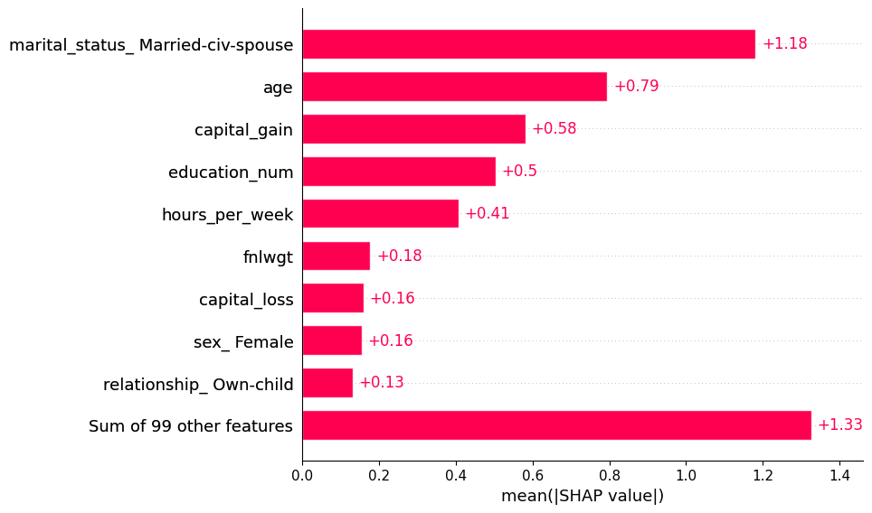
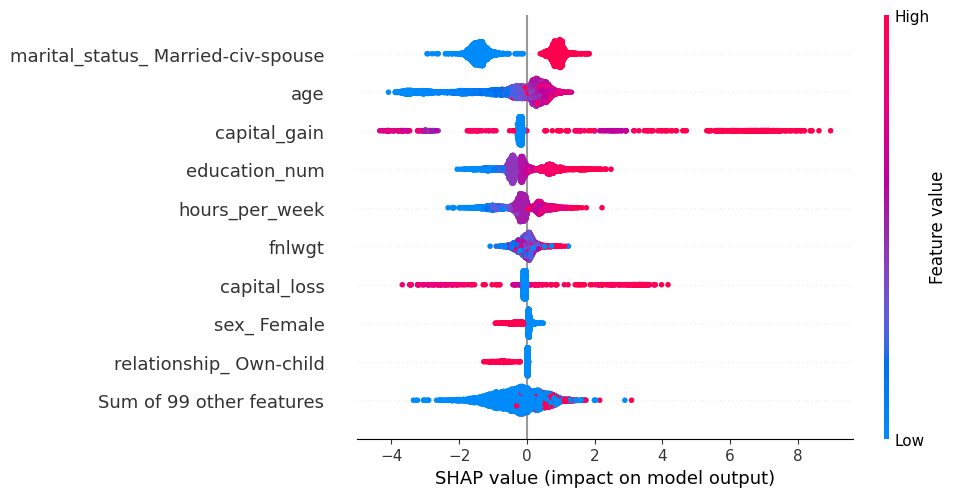
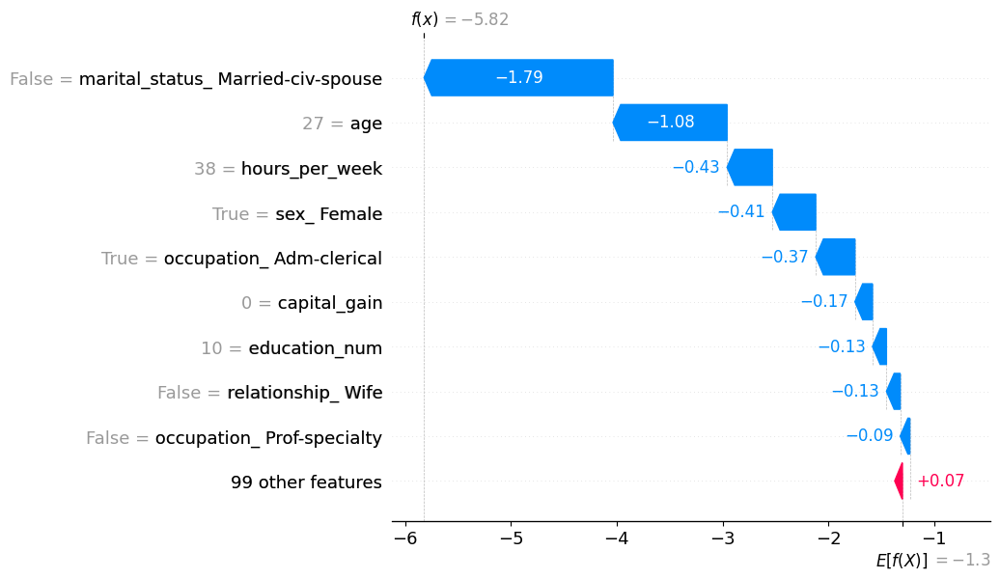

# Income Prediction Using XGBoost and SHAP

This project builds a machine learning model to predict whether an individual's income exceeds $50K using demographic and employment attributes from the Adult Census dataset.

## Technologies
- Python
- XGBoost
- SHAP
- Scikit-learn
- Pandas

## Model Performance
Accuracy: 0.87

## Key Insights
- Education level strongly influences income prediction
- Capital gain is a major predictor of high income
- Hours worked per week contributes to income classification

## Explainability
SHAP values were used to interpret model predictions and identify the most influential features.

## Feature Importance Plot

## Beeswarm Plo

## Key Insights

