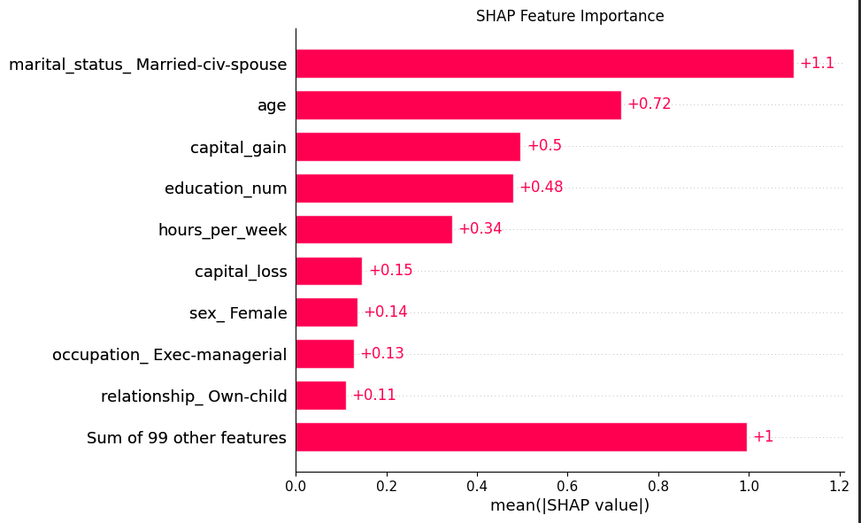

# Adult Income Classification with XGBoost, Logistic Regression, and SHAP

# Project Overview
This project builds machine learning models to predict whether a person earns more than $50K per year using the Adult Census Income dataset. The goal was to compare a simple model (Logistic Regression) with a more advanced model (XGBoost) and evaluate how well each one performs.

# Business Applications
This project simulates a real-world problem similar to risk assessment in insurance or finance. For example, identifying higher-income individuals can help with pricing decisions, underwriting, or understanding customer profiles. The project also looks at the tradeoff between model accuracy and how easy the model is to explain.

# Models Used
Logistic Regression
XGBoost Classifier

# What I did:
- Cleaned the dataset and handled missing values
- Converted categorical data into numeric format using one-hot encoding
- Split the data into training and testing sets
- Hyperparameter tuned the XGBoost model with GridSearchCV
- Evaluated model performance using:
    -Accuracy
    -Precision and Recall
    -F1-score
    -ROC-AUC
    -Confusion matrix
- Used SHAP values to understand which features influenced model predictions.

, where XGBoost achieved better precision, recall, and F1-score.
XGBoost likely performed better because it captures non-linear relationships and feature interactions more effectively than Logistic Regression.
Logistic Regression remained useful as a transparent, interpretable baseline.

## Technologies
- Python
- XGBoost
- SHAP
- Scikit-learn
- Pandas
- matplotlib

## Explainability
SHAP values were used to interpret model predictions and identify the most influential features.

## Feature Importance Plot

## Beeswarm Plot

## Key Insights

## Future Improvements
Rebuild preprocessing using Pipeline and ColumnTransformer
Add cross-validation reporting and stronger hyperparameter tuning
Save plots and results automatically
Explore threshold tuning and class imbalance strategies
