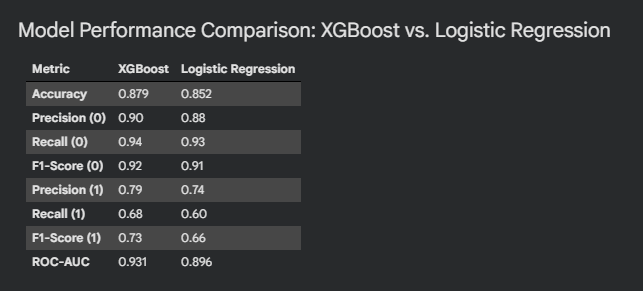
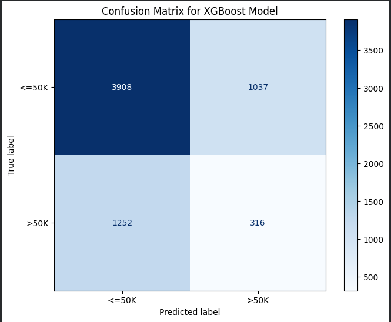

# Adult Income Classification with XGBoost, Logistic Regression, and SHAP

## Project Overview
This project builds machine learning models to predict whether a person earns more than $50K per year using the Adult Census Income dataset. The goal was to compare a simple model (Logistic Regression) with a more advanced model (XGBoost) and evaluate how well each one performs.

## Business Applications
This project simulates a real-world problem similar to risk assessment in insurance or finance. For example, identifying higher-income individuals can help with pricing decisions, underwriting, or understanding customer profiles. The project also looks at the tradeoff between model accuracy and how easy the model is to explain.

## Models Used
Logistic Regression
XGBoost Classifier

## Approach
- Cleaned the dataset and handled missing values
- Converted categorical data into numeric format using one-hot encoding
- Split the data into training and testing sets
- Hyperparameter tuned the XGBoost model with GridSearchCV
- Evaluated model performance using:
    - Accuracy
    - Precision and Recall
    - F1-score
    - ROC-AUC
    - Confusion matrix
- Used SHAP to understand which features influenced model predictions.

## Results
The table shows that XGBoost achieved higher accuracy, F1-scores, and ROC-AUC than Logistic Regression across both classes.

## Model Comparison

## Confusion Matrix
The confusion matrix shows how well the model classifies each group. It helps highlight where the model makes mistakes, such as predicting high income when it is not true (false positives) or missing high-income individuals (false negatives).

##Confusion Matrix

## Key Findings
- XGBoost performed better than Logistic Regression across all major metrics
- The biggest improvement was in identifying higher-income individuals (>50K)
- XGBoost likely performed better because it can capture more complex relationships in the data
- Logistic Regression was still useful as a simple and more interpretable baseline

## Technologies
- Python
- XGBoost
- SHAP
- Scikit-learn
- Pandas
- matplotlib

## Explainability
I used SHAP (SHapley Additive exPlanations) to understand how different features influenced the model’s predictions. This helps make the model more transparent and easier to interpret.

## Feature Importance Plot

## Beeswarm Plot

## Waterfall Plot

## Future Improvements
- Rebuild preprocessing using Pipeline and ColumnTransformer
- Add cross-validation reporting and stronger hyperparameter tuning
- Save plots and results automatically
- Explore threshold tuning and class imbalance strategies
